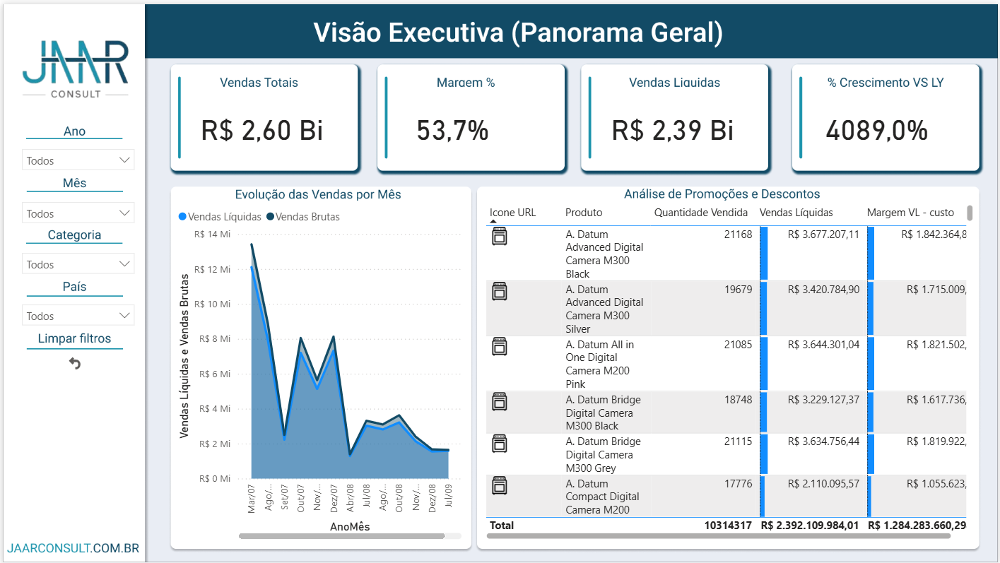
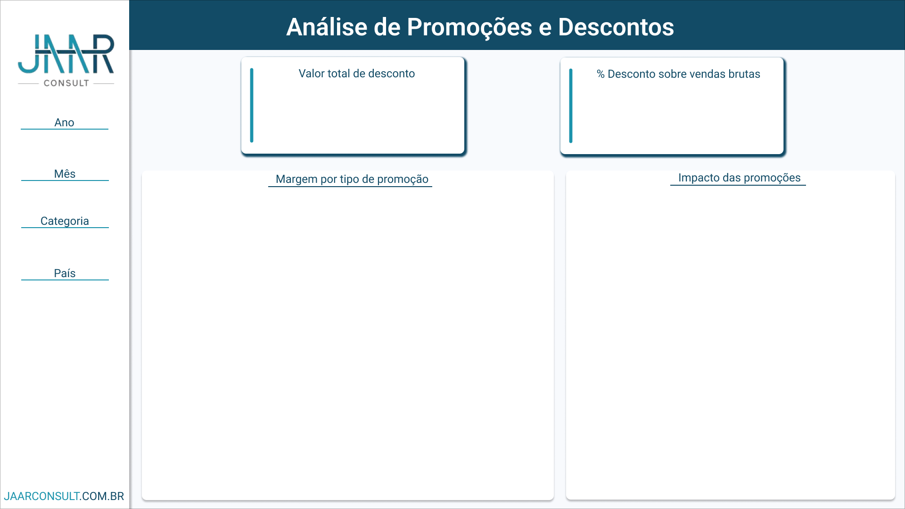
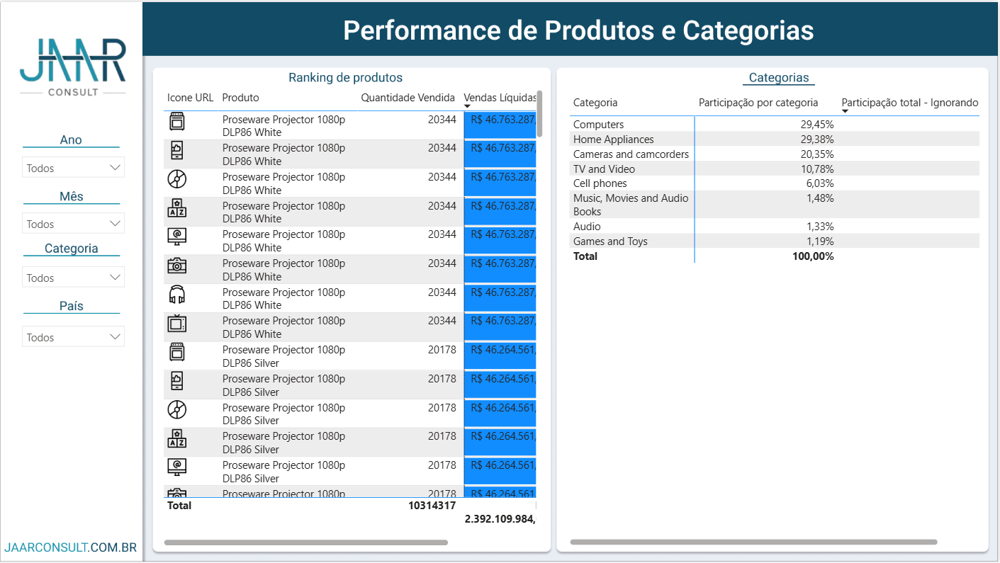

# Strategic Sales Analysis




Executive Power BI case developed for the Jaar Consult evaluation. The project organizes commercial data into a semantic KPI layer focused on pricing, promotions, product performance, and fast managerial reading.

## Executive Summary

This repository is a compact BI case designed to answer a practical business question: how can sales performance, discount pressure, and product behavior be presented in a way that supports executive decisions without turning the dashboard into noise?

The solution uses a business-oriented data model and DAX measures to create a concise decision-support experience across three complementary views:

- executive overview
- promotions and discount analysis
- product and category performance

## Business Problem

Commercial data often becomes fragmented across static spreadsheets and isolated visual checks. The goal here was to consolidate that reading into a structured dashboard capable of answering:

- how sales are performing at a high level
- how discounts are affecting revenue and margin behavior
- which products and categories drive the strongest results

## Dashboard Scope

### Executive Overview

High-level KPIs for revenue, operational reading, and overall commercial health.


### Promotions And Discounts

A focused lens on pricing pressure and discount behavior.



### Product And Category Performance

Granular product reading to support assortment and portfolio interpretation.



## What This Project Demonstrates

- semantic modeling for business-facing BI
- DAX as a reusable KPI contract
- dashboard hierarchy designed for executive consumption
- separation between overview, pricing, and product analysis
- stronger commercial storytelling than a spreadsheet-first approach

## Repository Structure

```text
PS PBI Jaar Consult/
├── assets/
│   ├── analise-promocoes.png
│   ├── logo_jaar.png
│   ├── performance-produtos.png
│   └── visao-executiva.png
├── docs/
├── Analise-Estrategica-de-Vendas.pdf
├── *.pbix
└── README.md
```

## How To Review

### Option 1. Open the PBIX file

Open the main `.pbix` file in the repository root to inspect the report structure, KPI layer, and interactive experience.

### Option 2. Review the exported material

Use the PDF and PNG assets if you want a fast visual review of the dashboard without opening Power BI.

## Technical Stack

- Power BI
- DAX
- Data modeling
- Visual KPI design

## Portfolio Relevance

This case is relevant in a senior portfolio because it shows that BI work is not only about chart creation. It is about organizing analytical logic, defining hierarchy, and turning commercial data into a compact diagnostic layer for decisions on pricing and sales performance.

## Author

**Diego Pablo**

- Portfolio: [diego-pablo.vercel.app](https://diego-pablo.vercel.app/)
- LinkedIn: [linkedin.com/in/diego-pablo](https://www.linkedin.com/in/diego-pablo/)
